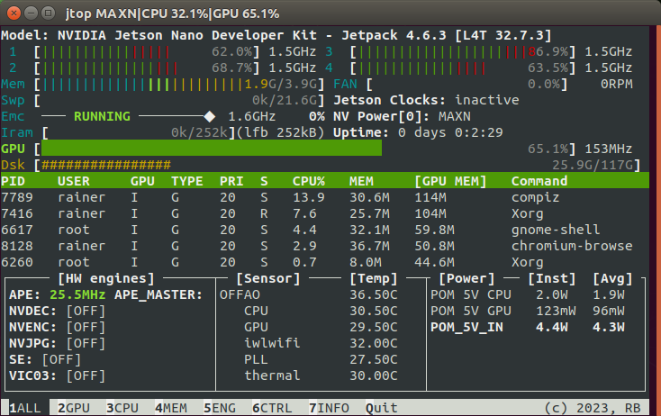
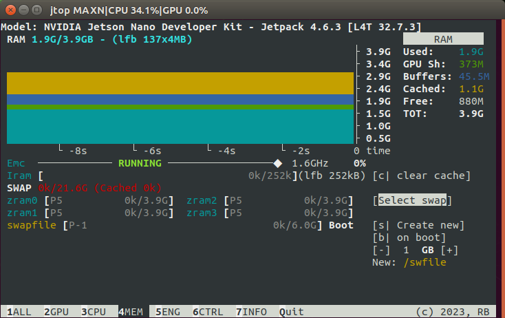
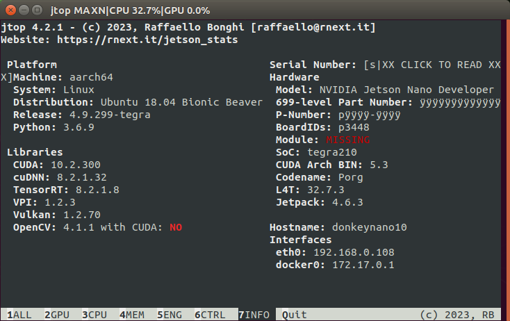

# donkeycar-test-tf_2_9
testing https://github.com/autorope/donkeycar/tree/tf_2_9

# Jetson Nano 4GB

## 1 setup
### 1.1 get repos
- /media/rainer/_data/30-projects/42-DIYrobocars/donkeycar
```
git remote add upstream https://github.com/autorope/donkeycar
git remote add origin https://github.com/Heavy02011/donkeycar

(sds16) rainer@neuron2204:/media/rainer/_data/30-projects/42-DIYrobocars/donkeycar$ 
git remote -v
origin	https://github.com/Heavy02011/donkeycar.git (fetch)
origin	https://github.com/Heavy02011/donkeycar.git (push)
upstream	https://github.com/autorope/donkeycar (fetch)
upstream	https://github.com/autorope/donkeycar (push)
git fetch --all
git push origin tf_2_9
git checkout tf_2_9
```
- /media/rainer/_data/30-projects/42-DIYrobocars/donkeydocs
```
git checkout Update_to_tf_29

(sds16) rainer@neuron2204:/media/rainer/_data/30-projects/42-DIYrobocars/donkeydocs$ 
git remote -v
origin	https://github.com/Heavy02011/donkeydocs.git (fetch)
origin	https://github.com/Heavy02011/donkeydocs.git (push)
```
### 1.2 follow [donkeydocs](https://github.com/autorope/donkeydocs/blob/Update_to_tf_29/docs/guide/robot_sbc/setup_jetson_nano.md#installation-for-donkey-car-main)

## 2 results
## 2.1 jtop




## 2.2 [OpenCV 4.6, tf 2.9, camera succesful](https://github.com/Heavy02011/donkeycar-test-tf_2_9/blob/main/test-result.md)

## 2.3 [pytest results in some errors, permissions gpio?](https://github.com/Heavy02011/donkeycar-test-tf_2_9/blob/main/pytest-log.txt)

## 2.4 hints
- [ ] give size of swapfile as default is 6 not 8 G, no way to change afterwards
- [ ] git checkout **main** NOT **tf_2_9**?


# PC Ubuntu 22.04, 16GB, NVIDIA GTX 1040Ti

```mamba env create -f install/envs/ubuntu.yml``` takes "ages" and is not finishing the install
so I copied another env and converted the ```install/envs/ubuntu.yaml``` to a ```ubuntu_requirements.txt```
and installed that with ```pip install -r ubuntu_requrements.txt```:

```
conda create --name tf_2_9 --clone openai
conda activate tf_2_9
python convert-yaml-req.py install/envs/ubuntu.yml ubuntu_requirements.txt
pip install -r ubuntu_requirements.txt 

sudo apt install libopencv-dev python3-opencv
pip install --upgrade pip setuptools
pip cache purge
pip install codecov 
```

- ubuntu_requirements.txt 
```
numpy
h5py
pillow
matplotlib
tornado
opencv-python
docopt
pandas
pylint
pytest
pytest-cov
#codecov
pip
progress
paho-mqtt
PrettyTable
pyfiglet
mypy
#pytorch
#torchvision==0.12
#torchaudio
#pytorch-lightning>=1.9,<2.0
psutil
plotly
pyyaml
tensorflow==2.9
fastai
pynmea2
pyserial
utm
albumentations
```

- Check torch gpu
```
(tf_2_9) rainer@neuron2204:/media/rainer/_data/30-projects/42-DIYrobocars/donkeycar$ 
python
Python 3.8.16 (default, Mar  2 2023, 03:21:46) 
[GCC 11.2.0] :: Anaconda, Inc. on linux
Type "help", "copyright", "credits" or "license" for more information.
>>> import torch
>>> torch.cuda.is_available()
True
>>> torch.cuda.device_count()
1
>>> torch.cuda.current_device()
0
>>> torch.cuda.device(0)
<torch.cuda.device object at 0x7ff9914e78b0>
>>> torch.cuda.get_device_name(0)
'NVIDIA GeForce GTX 1080 Ti'
```

- error when installing gym-donkeycar
```
(tf_2_9) rainer@neuron2204:/media/rainer/_data/30-projects/42-DIYrobocars/gym-donkeycar$ pip install -e .[gym-donkeycar]
Obtaining file:///media/rainer/_data/30-projects/42-DIYrobocars/gym-donkeycar
  Preparing metadata (setup.py) ... done
WARNING: gym-donkeycar 1.3.0 does not provide the extra 'gym-donkeycar'
Collecting gym==0.21 (from gym-donkeycar==1.3.0)
  Downloading gym-0.21.0.tar.gz (1.5 MB)
     ━━━━━━━━━━━━━━━━━━━━━━━━━━━━━━━━━━━━━━━━ 1.5/1.5 MB 14.7 MB/s eta 0:00:00
  Preparing metadata (setup.py) ... error
  error: subprocess-exited-with-error
  
  × python setup.py egg_info did not run successfully.
  │ exit code: 1
  ╰─> [1 lines of output]
      error in gym setup command: 'extras_require' must be a dictionary whose values are strings or lists of strings containing valid project/version requirement specifiers.
      [end of output]
  
  note: This error originates from a subprocess, and is likely not a problem with pip.
error: metadata-generation-failed

× Encountered error while generating package metadata.
╰─> See above for output.

note: This is an issue with the package mentioned above, not pip.
hint: See above for details.
```
fixed with a ```pip uninstall gym``` and retrying ```pip install -e .[gym-donkeycar]```
