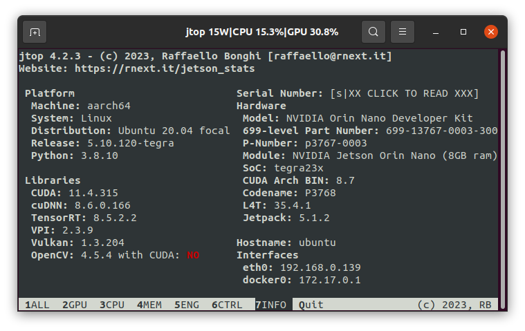

# Install log on SDCARD *n13* connected over USB
This documents the installation apart from just testing branch main of DC5.0dev3.



## 1 [tests results](./logs/)
- [Try01: original install/envs/jetson.yml](./logs/Try01_test-result.md)
- [Try02: install/envs/jetson_rb2.yml without *opencv*](./logs/Try02_test-result.md)

<new stuff here>

## 2 Legacy stuff

### 2.1 docker
- [x] run without sudo
```
sudo groupadd docker
sudo usermod -aG docker $USER
docker run hello-world
```
- [x] [default nvidia runtime](https://github.com/dusty-nv/jetson-containers)

/etc/docker/daemon.json
```
{
    "runtimes": {
        "nvidia": {
            "path": "nvidia-container-runtime",
            "runtimeArgs": []
        }
    },

    "default-runtime": "nvidia"
}
```

### 2.2 applications
- [x] https://github.com/JetsonHacksNano/installVSCode.git
- [x] ```sudo apt install joystick jstest-gtk evtest```
- [x] ```sudo apt update && sudo apt install libcurl4-gnutls-dev```
- [x] ```sudo apt update && sudo apt install libssl-dev```
- [x] store git credential
    ```   
    sudo apt-get install libsecret-1-0 libsecret-1-dev
    cd /usr/share/doc/git/contrib/credential/libsecret
    sudo make
    git config --global credential.helper /usr/share/doc/git/contrib/credential/libsecret/git-credential-libsecret    
    ```
- [x] jtop
    ```
    sudo apt-get update
    sudo apt-get install python3-pip
    sudo -H pip3 install jetson-stats
    ```
- [x] swap space 8GB
    ```
    git clone https://github.com/JetsonHacksNano/installSwapfile
    cd installSwapfile
    ./installSwapfile.sh -s 8
    reboot 
    ```
- [x] sudo apt install curl
- [x] sudo sh -c 'echo "deb http://packages.ros.org/ros/ubuntu $(lsb_release -sc) main" > /etc/apt/sources.list.d/ros-latest.list'
- [x] curl -s https://raw.githubusercontent.com/ros/rosdistro/master/ros.asc | sudo apt-key add -
- [x] sudo apt update && sudo apt-get install python3-rocker


## 3 networking

- [x] [hotspot](https://medium.com/@jones.0bj3/wireless-networking-for-the-jetson-nano-and-rpi-504868dd1b3a)
- [x] creating hotspot ```sudo -i -u rainer nmcli dev wifi hotspot ifname wlan1 ssid rbnano1-drivingnetwork password XXXXXXXX```
  ```wlan1: 5C:87:9C:1E:BB:4E```
- [x] starting hotspot at [boot](https://askubuntu.com/questions/48321/how-do-i-start-applications-automatically-on-login) ```nmcli c up rbnano1-drivingnetwork```
- [x] plugin EDIMAX for internet connection 
  ```wlan0: 74:DA:38:EA:0B:07```

```
sudo -i -u rainer nmcli dev wifi hotspot ifname wlan1 ssid rbnano1-drivingnetwork password XXXXXXXX
```
- [x] [bluetooth autoconnector](https://github.com/noraworld/bluetoothctl-autoconnector.git)
```
(donkey) rainer@donkeynano10:~/dev/bluetoothctl-autoconnector$ sudo bluetoothctl
[bluetooth]# agent on
[bluetooth]# power on
[bluetooth]# scan on
Discovery started
[NEW] Device 7C:BB:8A:7A:2B:4B 7C-BB-8A-7A-2B-4B
[bluetooth]# connect 7C:BB:8A:7A:2B:4B 
Attempting to connect to 7C:BB:8A:7A:2B:4B
[CHG] Device 7C:BB:8A:7A:2B:4B Connected: yes
[CHG] Device 7C:BB:8A:7A:2B:4B Modalias: usb:v057Ep0330d0001
[CHG] Device 7C:BB:8A:7A:2B:4B UUIDs: 00001124-0000-1000-8000-00805f9b34fb
[CHG] Device 7C:BB:8A:7A:2B:4B UUIDs: 00001200-0000-1000-8000-00805f9b34fb
[CHG] Device 7C:BB:8A:7A:2B:4B ServicesResolved: yes
[Nintendo RVL-CNT-01-UC]# trust 7C:BB:8A:7A:2B:4B 
[CHG] Device 7C:BB:8A:7A:2B:4B Trusted: yes
Changing 7C:BB:8A:7A:2B:4B trust succeeded
```
## 4 donkey tf_2_9 environment ```donkey``` has the [problem of missing comput_53 capability](https://github.com/autorope/donkeycar/issues/1124)
```
(donkey) rainer@donkeynano11:~/opencv/build$ python3
Python 3.9.16 | packaged by conda-forge | (main, Feb  1 2023, 22:05:40) 
[GCC 11.3.0] on linux
Type "help", "copyright", "credits" or "license" for more information.
>>> import cv2
>>> print(cv2.getBuildInformation()) 

General configuration for OpenCV 4.6.0 =====================================
  Version control:               unknown

  Extra modules:
    Location (extra):            /home/rainer/opencv_contrib/modules
    Version control (extra):     unknown

  Platform:
    Timestamp:                   2023-05-15T21:19:12Z
    Host:                        Linux 4.9.299-tegra aarch64
    CMake:                       3.10.2
    CMake generator:             Unix Makefiles
    CMake build tool:            /usr/bin/make
    Configuration:               RELEASE

  CPU/HW features:
    Baseline:                    NEON FP16
      required:                  NEON

  C/C++:
    Built as dynamic libs?:      YES
    C++ standard:                11
    C++ Compiler:                /usr/bin/c++  (ver 7.5.0)
    C++ flags (Release):         -fsigned-char -ffast-math -W -Wall -Wreturn-type -Wnon-virtual-dtor -Waddress -Wsequence-point -Wformat -Wformat-security -Wmissing-declarations -Wundef -Winit-self -Wpointer-arith -Wshadow -Wsign-promo -Wuninitialized -Wsuggest-override -Wno-delete-non-virtual-dtor -Wno-comment -Wimplicit-fallthrough=3 -Wno-strict-overflow -fdiagnostics-show-option -pthread -fomit-frame-pointer -ffunction-sections -fdata-sections    -fvisibility=hidden -fvisibility-inlines-hidden -fopenmp -O3 -DNDEBUG  -DNDEBUG
    C++ flags (Debug):           -fsigned-char -ffast-math -W -Wall -Wreturn-type -Wnon-virtual-dtor -Waddress -Wsequence-point -Wformat -Wformat-security -Wmissing-declarations -Wundef -Winit-self -Wpointer-arith -Wshadow -Wsign-promo -Wuninitialized -Wsuggest-override -Wno-delete-non-virtual-dtor -Wno-comment -Wimplicit-fallthrough=3 -Wno-strict-overflow -fdiagnostics-show-option -pthread -fomit-frame-pointer -ffunction-sections -fdata-sections    -fvisibility=hidden -fvisibility-inlines-hidden -fopenmp -g  -O0 -DDEBUG -D_DEBUG
    C Compiler:                  /usr/bin/cc
    C flags (Release):           -fsigned-char -ffast-math -W -Wall -Wreturn-type -Waddress -Wsequence-point -Wformat -Wformat-security -Wmissing-declarations -Wmissing-prototypes -Wstrict-prototypes -Wundef -Winit-self -Wpointer-arith -Wshadow -Wuninitialized -Wno-comment -Wimplicit-fallthrough=3 -Wno-strict-overflow -fdiagnostics-show-option -pthread -fomit-frame-pointer -ffunction-sections -fdata-sections    -fvisibility=hidden -fopenmp -O3 -DNDEBUG  -DNDEBUG
    C flags (Debug):             -fsigned-char -ffast-math -W -Wall -Wreturn-type -Waddress -Wsequence-point -Wformat -Wformat-security -Wmissing-declarations -Wmissing-prototypes -Wstrict-prototypes -Wundef -Winit-self -Wpointer-arith -Wshadow -Wuninitialized -Wno-comment -Wimplicit-fallthrough=3 -Wno-strict-overflow -fdiagnostics-show-option -pthread -fomit-frame-pointer -ffunction-sections -fdata-sections    -fvisibility=hidden -fopenmp -g  -O0 -DDEBUG -D_DEBUG
    Linker flags (Release):      -Wl,--gc-sections -Wl,--as-needed -Wl,--no-undefined  
    Linker flags (Debug):        -Wl,--gc-sections -Wl,--as-needed -Wl,--no-undefined  
    ccache:                      NO
    Precompiled headers:         NO
    Extra dependencies:          m pthread cudart_static dl rt nppc nppial nppicc nppicom nppidei nppif nppig nppim nppist nppisu nppitc npps cublas cudnn cufft -L/usr/local/cuda/lib64 -L/usr/lib/aarch64-linux-gnu
    3rdparty dependencies:

  OpenCV modules:
    To be built:                 alphamat aruco barcode bgsegm bioinspired calib3d ccalib core cudaarithm cudabgsegm cudacodec cudafeatures2d cudafilters cudaimgproc cudalegacy cudaobjdetect cudaoptflow cudastereo cudawarping cudev datasets dnn dnn_objdetect dnn_superres dpm face features2d flann freetype fuzzy gapi hdf hfs highgui img_hash imgcodecs imgproc intensity_transform line_descriptor mcc ml objdetect optflow phase_unwrapping photo plot python3 quality rapid reg rgbd saliency sfm shape stereo stitching structured_light superres surface_matching text tracking ts video videoio videostab wechat_qrcode xfeatures2d ximgproc xobjdetect xphoto
    Disabled:                    python2 world
    Disabled by dependency:      -
    Unavailable:                 cvv java julia matlab ovis viz
    Applications:                perf_tests apps
    Documentation:               NO
    Non-free algorithms:         YES

  GUI:                           GTK3
    GTK+:                        YES (ver 3.22.30)
      GThread :                  YES (ver 2.56.4)
      GtkGlExt:                  NO
    VTK support:                 NO

  Media I/O: 
    ZLib:                        /usr/lib/aarch64-linux-gnu/libz.so (ver 1.2.11)
    JPEG:                        /usr/lib/aarch64-linux-gnu/libjpeg.so (ver 80)
    WEBP:                        /home/rainer/mambaforge/envs/donkey/lib/libwebp.so (ver encoder: 0x020f)
    PNG:                         /usr/lib/aarch64-linux-gnu/libpng.so (ver 1.6.34)
    TIFF:                        build (ver 42 - 4.2.0)
    JPEG 2000:                   build (ver 2.4.0)
    OpenEXR:                     build (ver 2.3.0)
    HDR:                         YES
    SUNRASTER:                   YES
    PXM:                         YES
    PFM:                         YES

  Video I/O:
    DC1394:                      YES (2.2.5)
    FFMPEG:                      YES
      avcodec:                   YES (57.107.100)
      avformat:                  YES (57.83.100)
      avutil:                    YES (55.78.100)
      swscale:                   YES (4.8.100)
      avresample:                YES (3.7.0)
    GStreamer:                   YES (1.14.5)
    v4l/v4l2:                    YES (linux/videodev2.h)

  Parallel framework:            TBB (ver 2020.2 interface 11102)

  Trace:                         YES (with Intel ITT)

  Other third-party libraries:
    Lapack:                      YES (/usr/lib/aarch64-linux-gnu/liblapack.so /usr/lib/aarch64-linux-gnu/libcblas.so /usr/lib/aarch64-linux-gnu/libatlas.so)
    Eigen:                       YES (ver 3.3.4)
    Custom HAL:                  YES (carotene (ver 0.0.1))
    Protobuf:                    build (3.19.1)

  NVIDIA CUDA:                   YES (ver 10.2, CUFFT CUBLAS FAST_MATH)
    NVIDIA GPU arch:             53
    NVIDIA PTX archs:

  cuDNN:                         YES (ver 8.2.1)

  Python 3:
    Interpreter:                 /home/rainer/mambaforge/envs/donkey/bin/python3 (ver 3.9.16)
    Libraries:                   /home/rainer/mambaforge/envs/donkey/lib/libpython3.9.so (ver 3.9.16)
    numpy:                       /home/rainer/mambaforge/envs/donkey/lib/python3.9/site-packages/numpy/core/include (ver 1.24.3)
    install path:                /home/rainer/mambaforge/envs/donkey/lib/python3.9/site-packages/cv2/python-3.9

  Python (for build):            /usr/bin/python2.7

  Java:                          
    ant:                         NO
    JNI:                         NO
    Java wrappers:               NO
    Java tests:                  NO

  Install to:                    /home/rainer/mambaforge/envs/donkey
-----------------------------------------------------------------

```


## 5 donkey tf_2_9 environment ```donkey212```
```
conda clone --name donkey212 --clone donkey
conda activate donkey212
pip uninstall tensorflow
pip install tensorflow
```

checking tensorflow & OpenCV
```
(donkey212) rainer@donkeynano11:~$ python
Python 3.9.16 | packaged by conda-forge | (main, Feb  1 2023, 22:05:40) 
[GCC 11.3.0] on linux
Type "help", "copyright", "credits" or "license" for more information.
>>> import tensorflow as tf
>>> tf.sysconfig.get_build_info()
OrderedDict([('is_cuda_build', False), ('is_rocm_build', False), ('is_tensorrt_build', False)])
>>> import cv2
>>> cv2.__version__
'4.6.0'
```

```
conda env config vars set PYTHONMEM=2GB --name donkey212
```

## 6 Autoware, new 2023, [following](https://autowarefoundation.github.io/autoware-documentation/main/installation/autoware/docker-installation/) 

build
```
(donkey212) rainer@donkeynano11:~/projects/AutowareAuto$ 
DIS: rocker --nvidia --x11 --user --volume $HOME/autoware -- ghcr.io/autowarefoundation/autoware-universe:humble-latest-cuda-arm64

rocker -e LIBGL_ALWAYS_SOFTWARE=1 --x11 --user --volume $HOME/autoware -- ghcr.io/autowarefoundation/autoware-universe:latest-cuda

cd autoware
mkdir src
vcs import src < autoware.repos
vcs pull src

source /opt/ros/humble/setup.bash
sudo apt update
rosdep update
rosdep install -y --from-paths src --ignore-src --rosdistro $ROS_DISTRO

colcon build --symlink-install --cmake-args -DCMAKE_BUILD_TYPE=Relee --executor sequential 
```

persist
```
docker ps ---> {container_ID}
docker commit {container_ID}  autoware-n11
docker commit 33e91f955b74  autoware-n11
docker tag autoware-n11 heavy02011/autoware-n11:20230619-JetsonNano-jp4.6.3
docker push heavy02011/autoware-n11:20230619-JetsonNano-jp4.6.3
```

running persitet container *** FAILS ****
```
rocker -e LIBGL_ALWAYS_SOFTWARE=1 --x11 --user --volume $HOME/autoware -- heavy02011/autoware-n11:20230619-JetsonNano-jp4.6.3
##ghcr.io/autowarefoundation/autoware-universe:latest-cuda
```

setup in container
```
sudp apt-get update
sudo apt-get install tmux

```

show frames
```
rainer@d331c72b0bd1:~/autoware$ 
ros2 run tf2_tool view_frames 
```

[testing](https://autowarefoundation.github.io/autoware-documentation/main/tutorials/ad-hoc-simulation/planning-simulation/#lane-change-scenario)
```
tmux
gdown -O ~/autoware/map/ 'https://docs.google.com/uc?export=download&id=1499_nsbUbIeturZaDj7jhUownh5fvXHd'
unzip -d ~/autoware/map ~/autoware_map/sample-map-planning.zip

source ~/autoware/install/setup.bash
ros2 launch autoware_launch planning_simulator.launch.xml map_path:=/home/rainer/autoware/map/sample-map-planning vehicle_model:=sample_vehicle sensor_model:=sample_sensor_kit

source ~/autoware/install/setup.bash
ros2 service call /api/operation_mode/change_to_autonomous autoware_adapi_v1_msgs/srv/ChangeOperationMode {}
```

################################################################


## [ade](https://gitlab.com/ApexAI/ade-cli/-/releases)
```
chmod +x ade
ade
./ade
sudo mv ade /usr/local/bin/
ade --version
ade update-cli
ade --version

mkdir -p ~/adehome
cd adehome/
touch .adehome
git clone https://gitlab.com/autowarefoundation/autoware.auto/AutowareAuto.git
d AutowareAuto/
git branch -a|grep etson
git checkout f1tenth-devel-jetson

cp ~/.bashrc ~/.bashrc.bak
mv ~/.bashrc ~/adehome/.bashrc
ln -s ~/adehome/.bashrc
cd adehome/

cd AutowareAuto/
ade start --update --enter
ade --rc .aderc-jetson-f1tenth start --update --enter  # NOT WORKING
```


## [joystick](https://github.com/ros-drivers/joystick_drivers/tree/main/joy)
install
```
sudo apt install joystick jstest-gtk evtest
sudo apt-get install ros-melodic-joy
git clone https://github.com/ros-drivers/joystick_drivers.git
```
launch
```
rosrun joy joy_node _dev_name:="*"
```
show
```
rostopic echo /joy
```


## pwm

[x] throttle
```
donkey calibrate --bus 1 --channel 0
```
[x] steering
```
donkey calibrate --bus 1 --channel 1
```

```
cp rbnano1-drivingnetwork /etc/NetworkManager/system-connections/
nmcli c up rbnano1-drivingnetwork
nmcli c down rbnano1-drivingnetwork
```

## [ROS](https://gist.github.com/Pyrestone/ef683aec160825eee5c252f22218ddb2)
```
apt-cache search ros-melodic-driver-base
sudo sh -c 'echo "deb http://packages.ros.org/ros/ubuntu $(lsb_release -sc) main" > /etc/apt/sources.list.d/ros-latest.list'
curl -s https://raw.githubusercontent.com/ros/rosdistro/master/ros.asc | sudo apt-key add -
curl -s https://raw.githubusercontent.com/ros/rosdistro/master/ros.asc | sudo apt-key add -
sudo sh -c 'echo "deb http://packages.ros.org/ros/ubuntu $(lsb_release -sc) main" > /etc/apt/sources.list.d/ros-latest.list'
curl -s https://raw.githubusercontent.com/ros/rosdistro/master/ros.asc | sudo apt-key add -

sudo apt-get install ros-melodic-driver-base
sudo apt-get install ros-melodic-desktop-full
sudo apt-get install ros-melodic-turtlebot3 
sudo apt-get install ros-melodic-joy
sudo apt-get install ros-melodic-slam-toolbox
```

## lidar RPlidar
install
```
sudo apt-get install ros-melodic-rplidar-ros
sudo chmod 666 /dev/ttyUSB0
```
run
```
roslaunch rplidar_ros rplidar.launch
```

## lidar D300
```
cd ~/ldlidar_ros_ws$ 
cattkin_make
source devel/setup.bash
#roslaunch ldlidar_stl_ros ld06.launch 
roslaunch ldlidar_stl_ros viewer_ld06_kinetic_melodic.launch
```

## jetson-utils
```
sudo apt-get install libgstreamer-plugins-base1.0-dev libgstreamer-plugins-bad1.0-dev libgstreamer-plugins-good1.0-dev libgstreamer1.0-dev
git clone https://github.com/GStreamer/gst-plugins-bad.git
cd gst-plugins-bad
git checkout 1.18.4  # Replace with the latest stable version of GStreamer
./autogen.sh --noconfigure
./configure --prefix=/usr --with-package-name="GStreamer Bad Plugins (Ubuntu)" --with-package-origin=https://ubuntu.com --disable-deprecated --disable-examples --disable-tests --disable-docs --disable-gtk-doc --disable-libnice --disable-libwebrtc --disable-lv2 --disable-modplug --disable-mpeg2enc --disable-nsf --disable-opus --disable-realtime --disable-sbc --disable-siren --disable-smoothstreaming --disable-sndfile --disable-soundtouch --disable-spandsp --disable-srtp --disable-teletext --disable-timidity --disable-vulkan --disable-wasapi --disable-wildmidi --disable-x265 --disable-zbar
make -j$(nproc)
sudo make install


Navigate to the build directory:
cd ~/workspace/jetson-utils/build
Remove any previous build artifacts:
rm -rf *
Run CMake to configure the build:
cmake ..
Build the package:
make
Install the package:
sudo make install

Now the jetson-utils package should build successfully, and the missing json-glib/json-glib.h error should be resolved.


 1190  ll
 1191  cd build/
 1192  make
 1193  sudo apt-get install libsoup2.4-dev
 1194  make
 1195  sudo apt-get install gstreamer1.0-plugins-bad
 1196  rm -rf *
 1197  Reading state information... Done
 1198  cmake ..
 1199  make
 1200  (donkey) rainer@donkeynano10:~/projects/jetson-utils/build$ 
 1201  sudo apt-get install libgstreamer-plugins-base1.0-dev libgstreamer-plugins-bad1.0-dev libgstreamer-plugins-good1.0-dev libgstreamer1.0-dev
 1202  git clone https://github.com/GStreamer/gst-plugins-bad.git
 1203  cd gst-plugins-bad
 1204  git checkout 1.18.4  # Replace with the latest stable version of GStreamer
 1205  ./autogen.sh --noconfigure
 1206  ./configure --prefix=/usr --with-package-name="GStreamer Bad Plugins (Ubuntu)" --with-package-origin=https://ubuntu.com --disable-deprecated --disable-examples --disable-tests --disable-docs --disable-gtk-doc --disable-libnice --disable-libwebrtc --disable-lv2 --disable-modplug --disable-mpeg2enc --disable-nsf --disable-opus --disable-realtime --disable-sbc --disable-siren --disable-smoothstreaming --disable-sndfile --disable-soundtouch --disable-spandsp --disable-srtp --disable-teletext --disable-timidity --disable-vulkan --disable-wasapi --disable-wildmidi --disable-x265 --disable-zbar
 1207  make -j$(nproc)
 1208  sudo make install
 1209  ./configure --prefix=/usr --with-package-name="GStreamer Bad Plugins (Ubuntu)" --with-package-origin=https://ubuntu.com --disable-deprecated --disable-examples --disable-tests --disable-docs --disable-gtk-doc --disable-libnice --disable-libwebrtc --disable-lv2 --disable-modplug --disable-mpeg2enc --disable-nsf --disable-opus --disable-realtime --disable-sbc --disable-siren --disable-smoothstreaming --disable-sndfile --disable-soundtouch --disable-spandsp --disable-srtp --disable-teletext --disable-timidity --disable-vulkan --disable-wasapi --disable-wildmidi --disable-x265 --disable-zbar
 1210  ll
 1211  cd ..
 1212  \rm -r gst-plugins-bad/
 1213  rm -rf *
 1214  cmake ..
 1215  make
 1216  sudo apt-get install libjson-glib-dev
 1217  rm -rf *
 1218  cmake ..
 1219  make
 1220  sudo apt-get install libgstrtspserver-1.0-dev
 1221  rm -rf *
 1222  cmake ..
 1223  make
 1224  sudo make install
 1225  history 

/usr/include/gstreamer-1.0/gst/opencv
/usr/include/boost/compute/interop/opencv


Regenerate response


```

## [camera](https://github.com/dusty-nv/ros_deep_learning)
install
```

```
run
```

```


## [SLAM_TOOLBOX](https://github.com/SteveMacenski/slam_toolbox)
install
```
sudo apt install ros-melodic-slam-toolbox
```
config
```
cd /opt/ros/melodic/share/slam_toolbox/config/config.yaml
```
run
```
roslaunch slam_toolbox lifelong.launch 
roslaunch slam_toolbox online_sync.launch slam_params_file:=/path/to/your/config.yaml

roslaunch slam_toolbox online_sync.launch slam_params_file:=/home/rainer/catkin_ws/rb-slam-config.yaml

roslaunch slam_toolbox online_async.launch  args:='rb-slam-config.yaml'


```

## rviz 
```
rosrun rviz rviz -d /path/to/your/rb_slam_config.rviz

```

## tf
install
```
sudo apt-get update
sudo apt-get install ros-noetic-tf
```
run
```
rosrun tf tf_monitor
rosrun tf tf_monitor frame1 frame2
```

## rb_robot_slam
```
roslaunch rb_robot_slam rb-robot-slam.launch 
```

## ackerman_msg
```
sudo apt-get install ros-melodic-ackermann-msgs
```

## lidar udev

### LDROBOT D300
```
lsusb
Bus [Bus Number] Device [Device Number]: ID [idVendor]:[idProduct] [Device Manufacturer and Name]
Bus 001 Device 010: ID 10c4:ea60 Cygnal Integrated Products, Inc. CP210x UART Bridge / myAVR mySmartUSB light
```
/etc/udev/rules.d/99-ldrobot-d300.rules 
```
KERNEL=="ttyACM[0-9]*", ACTION=="add", ATTRS{idVendor}=="10c4", ATTRS{idProduct}=="ea60", MODE="0666", GROUP="dialout", SYMLINK+="sensors/hokuyo"
```

### RPlidar
Bus 001 Device 011: ID 10c4:ea60 Cygnal Integrated Products, Inc. CP210x UART Bridge / myAVR mySmartUSB light

/etc/udev/rules.d/99-rplidar.rules 
```
KERNEL=="ttyUSB[0-9]*", ACTION=="add", ATTRS{idVendor}=="10c4", ATTRS{idProduct}=="ea60", MODE="0666", GROUP="dialout", SYMLINK+="sensors/hokuyo"
```


install
```
sudo udevadm control --reload-rules && sudo udevadm trigger
```
