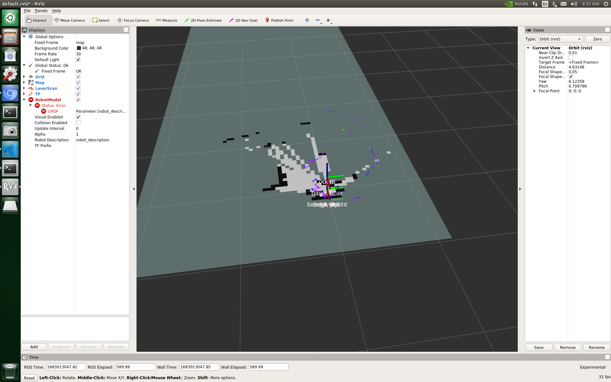
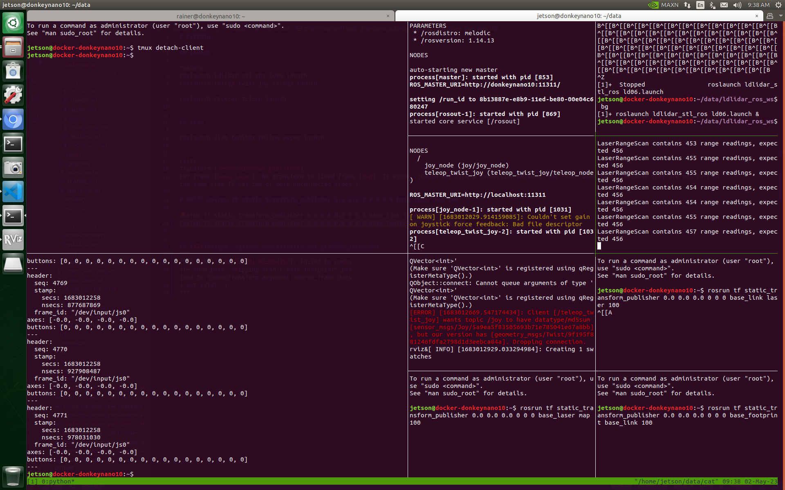
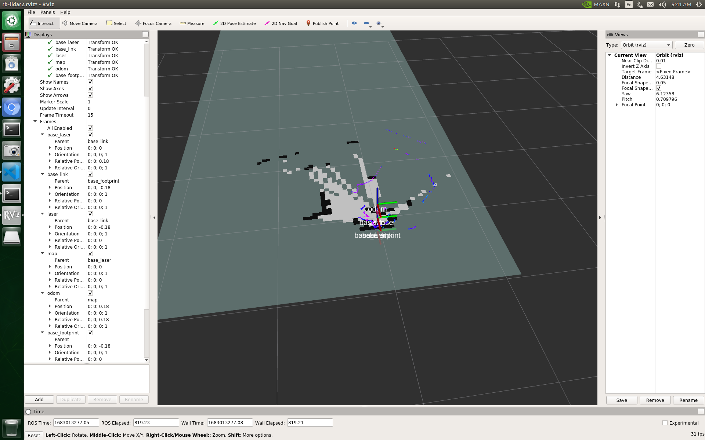
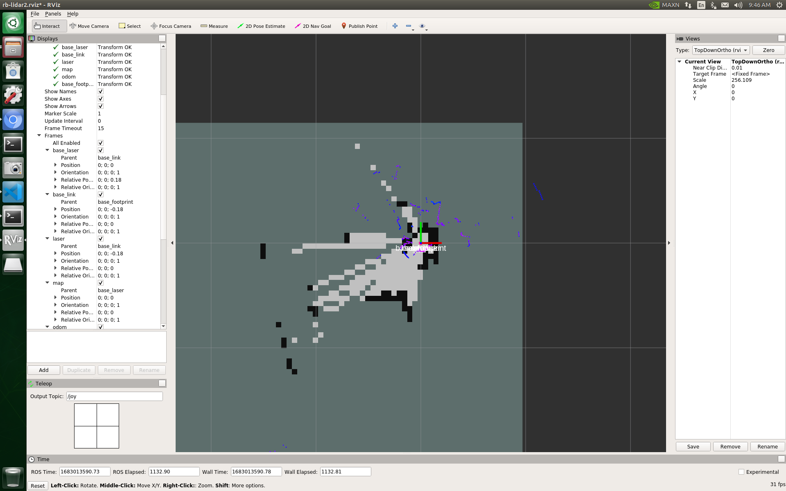

# F1TENTH

## launch
```
roscore
roslaunch ldlidar_stl_ros ld06.launch
roslaunch teleop_twist_joy teleop.launch

roslaunch racecar teleop.launch
```

## slam
```
roslaunch slam_toolbox online_async.launch 
```

rviz:
Transform [sender=unknown_publisher]
For frame [base_laser]: No transform to fixed frame [map]. TF error: [Could not find a connection between 'map' and 'base_laser' because they are not part of the same tree.Tf has two or more unconnected trees.]

# OK??? rosrun tf static_transform_publisher 0.0 0.0 0.0 0 0 0 base_laser map 100

rosrun tf static_transform_publisher 0.0 0.0 0.0 0 0 0 base_link laser 100
rosrun tf static_transform_publisher 0.0 0.0 0.0 0 0 0 base_footprint base_link 100


## [i2c](https://github.com/asibarr2/ros-pca9685-jetXavNX)
"""
│^C[ WARN] [1683012791.023864197]: Failed to compu
│te odom pose, skipping scan ("base_footprint" pas
│sed to lookupTransform argument source_frame does
│ not exist. )
"""

## documentation
first map


first map screenshot


tf


top down view

